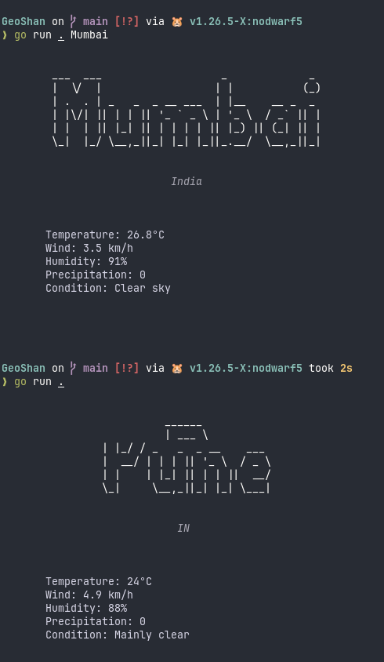

# GeoShan

A cool terminal-based weather application written in **Go** :D

GeoShan can get weather information for a city you provide, or automatically detect your location when no city is specified.



## Features

* Search weather by city name
* Automatic location detection
* Styled terminal

## Installation

Binaries are available on the Releases page.

### Linux

[Download GeoShan for Linux](https://github.com/shantanuparte/GeoShan/releases/download/v1.0.0/geoshan-linux-amd64)

Give the binary permission to run after download:

```bash
chmod +x geoshan-linux-amd64
```

Then run it:

```bash
./geoshan-linux-amd64
```

### Windows

[Download GeoShan for Windows](https://github.com/shantanuparte/GeoShan/releases/download/v1.0.0/geoshan-windows-amd64.exe)

Run the `.exe` file after downloading.

## Build for own

Clone the repo ¯\\_(ツ)_/¯

```bash
git clone https://github.com/shantanuparte/GeoShan.git
```

Build the binary:

```bash
go build -o geoshan .
```

## Usage

GeoShan has 2 features.

You can provide a city:

```bash
./geoshan Pune
```

Or for cities with spaces:

```bash
./geoshan "New York"
```

You can also run it without arguments:

```bash
./geoshan
```

When no city is provided, it determines your location automatically.

## License

I am using the MIT License for this project :D
